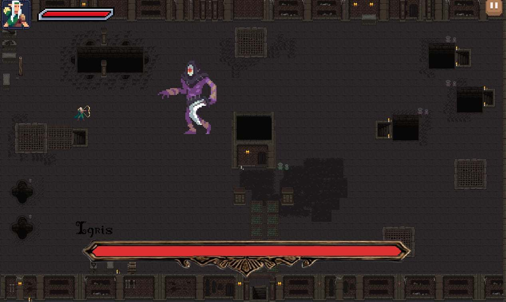

# Mẫu Báo Cáo Kết Quả Bài Tập Code Game

## 1. Thông Tin Nhóm

**Tên Dự Án:** [Tên dự án]

**Link Dự Án:** [Devil Gothic](https://github.com/longtrandev2/RPG-Game)

**Thành Viên Nhóm:**
- [Trần Khắc Long]
- [Phan An Phúc]
- [Mentor: Trần Xuân Sơn]
- [Mentor: Trần Đức Chính]


### Mô hình làm việc

Team hoạt động theo mô hình Scrum, sử dụng Linear để quản lý công việc. Các công việc được keep track đầy đủ trên Linear.
- Link linear: [Linear](https://linear.app/proptitgamejam/project/rpg-game-survival-a38cc9a57ae5/overview)

Mỗi tuần, team sẽ ngồi lại để review công việc đã làm, cùng nhau giải quyết vấn đề và đề xuất giải pháp cho tuần tiếp theo. Sau đó sẽ có buổi demo cho mentor để nhận phản hồi và hướng dẫn.

### Version Control Strategy


Team hoạt động theo Gitflow để quản lý code. Mỗi thành viên sẽ tạo branch từ `develop` để làm việc, các branch đặt theo format `feature/ten-chuc-nang`, sau khi hoàn thành sẽ tạo Pull Request để review code và merge vào develop
- Các nhánh chính:
  - `master`: Chứa code ổn định, đã qua kiểm tra và test kỹ lưỡng
  - `develop`: Chứa code mới nhất, đã qua review và test
  - `feature/`: Các nhánh chứa code đang phát triển, short-live, sau khi hoàn thành sẽ merge vào `develop`. 


Sau mỗi tuần, team sẽ merge `develop` vào `master` để release phiên bản mới.


## 2. Giới Thiệu Dự Án

**Mô tả:** Devil Gothic là một tựa game sinh tồn, khi mà bạn nhập vai thành một trong bốn vị anh hùng. Mỗi người lại có một vũ khí và một tính cách khác nhau tham gia vào quá trình chinh phục hầm ngục

Là một tựa game survival nơi người chơi được chọn chức nghiệp. Vượt qua từng tầng của hầm ngục, nơi bạn phải cố gắng sinh tồn qua các màn đến hơi thở cuối cùng để tồn tại lâu nhất có thể


## 3. Các Chức Năng Chính

- [Chức năng 1]: Nhân vật sẽ di chuyển bằng WASD, tấn công bằng J và dùng skills bằng K
- [Chức năng 2]: Qua mỗi stage, sẽ có bảng nâng cấp để nâng cấp các chỉ số nhân vật


## 4. Công nghệ:


### 4.1. Công Nghệ Sử Dụng
- Java language
- LibGDX framework
- Aesprite
- Gradle
- Tiled Map


### 4.2 Cấu trúc dự án

```
├── ProGameCup
│   ├── assets
│   │   ├── Enemy
│   │   │   ├── Goblin
│   │   │   ├── Rat
│   │   │   ├── Skeleton
│   │   │   ├── Orc
│   │   │   ├── Vampire
│   │   │   ├── Slime Boss
│   │   │   ├── King Skeleton
│   │   ├── Hero
│   │   │   ├── Knight
│   │   │   ├── Samurai
│   │   │   ├── Archer
│   │   │   ├── Wizard
│   │   ├── Map Asset
│   │   │   ├── MapFinal.tmx
│   │   │   ├── AssetMap
│   │   ├── Menu
│   │   │   ├── Main Menu
│   │   │   ├── Chossen Hero
│   │   │   ├── Decription Hero
│   │   │   ├── Game Screen
│   │   │   ├── Update Screen
│   │   │   ├── Pause
│   │   ├── Music
│   │   ├── Skils
│   │   │   ├── KnightSkill
│   │   │   ├── SamuraiSkill
│   │   │   ├── ArcherSkill
│   │   │   └── WizardSkill
│   ├── core
│   │   ├── src
│   │   │   ├── com.myteam.rpgsurvivor
│   │   │   │   ├── animation
│   │   │   │   │   ├── AnimationForEnemy
│   │   │   │   │   ├── AnimationForSummonedKnight
│   │   │   │   │   ├── AnimationLoader
│   │   │   │   │   ├── AnimationManager
│   │   │   │   ├── controller
│   │   │   │   │   ├── combat.attack.impl
│   │   │   │   │   │   ├── EnemyAttack
│   │   │   │   │   │   │   ├──MeleeAttackComponent
│   │   │   │   │   │   ├── HeroAttack
│   │   │   │   │   │   │   ├──MeleeAttackComponent
│   │   │   │   │   ├── AttackComponent
│   │   │   │   │   ├── movement
│   │   │   │   │   ├── spawn
│   │   │   │   │   ├── system
│   │   │   │   ├── debug
│   │   │   │   │   ├── debug
│   │   │   │   ├── input
│   │   │   │   │   ├── inputHandle
│   │   │   │   ├── model
│   │   │   │   │   ├── enum_type
│   │   │   │   │   ├── impl
│   │   │   │   │   │   ├── Knight
│   │   │   │   │   │   ├── Samurai
│   │   │   │   │   │   ├── Archer
│   │   │   │   │   │   ├── Wizard 
│   │   │   │   │   ├── Entity
│   │   │   │   │   ├── EntityStat
│   │   │   │   │   ├── Enemy
│   │   │   │   │   ├── Player
│   │   │   │   ├── scren
│   │   │   │   │   ├── menu
│   │   │   │   │   ├── .....
│   │   │   │   ├── skills
│   │   │   │   │   │   ├── KnightSkill
│   │   │   │   │   │   ├── SamuraiSkill
│   │   │   │   │   │   ├── ArcherSkill
│   │   │   │   │   │   ├── WizardSkill
│   │   │   └── ...
│   ├── desktop
│   │   ├── src
│   │   │   ├── com.mygdx.game
│   │   ├──...
│   ├── README.md
│   ├──...

```

Diễn giải:
- **assets:** Chứa các tài nguyên như hình ảnh, âm thanh
- **core:** Chứa các class chính của game như model, view, controller
- **desktop:** Chứa các class để chạy trên các nền tảng desktop"


## 5. Ảnh và Video Demo

**Ảnh Demo:**
)


**Video Demo:**
[Video Link](https://youtu.be/Q3M4Zyn8CQM)


## 6. Các Vấn Đề Gặp Phải

### Vấn Đề 1: [Render chồng lấn]
**Ví dụ:** Game gặp phải vấn đề khi render các element bị chồng lấn lên nhau khiến luồng game bị sai

### Hành Động Để Giải Quyết

**Giải pháp:** Do các dòng code bị setup sai dẫn đến việc đó
- Review lại code của nhau, để xử lí luồng render hợp lí. 

### Kết Quả

- Luồng render đã trở lại bình thường

### Vấn Đề 2: [Lỗi Gdx.setInputProcessor(stage)]
**Ví dụ:** Có quá nhiều stage cần lấy input clicked từ chuột nhưng bị chồng lấn các stage nên không nhận input từ chuột


### Hành Động Để Giải Quyết

**Giải pháp:** Đọc lại các phần set show của stage, set các dòng code ưu tiên cho stage nào để nhận input tương ứng để tránh chồng lấn.

### Kết Quả

- Các stage đã nhận đúng input từ chuột mà không gặp các confict.

### Vấn Đề 3: [Lỗi show stage]
**Ví dụ:** Lỗi khi không tính đế trường hợp phải đến trường hợp batch.draw và stage.draw cùng tương tác với nhau


### Hành Động Để Giải Quyết

**Giải pháp:** Đọc lại doc của LibGDX, xem cấu trúc hoạt động của batch và stage để sắp xếp lại code.

### Kết Quả

- Đã render được đúng.

### Vấn Đề 4: [Lỗi hitbox]
**Ví dụ:** Lỗi khi hitbox overlap lên nhau, hitbox render lên sai vị trí dẫn đến việc overlap không đúng


### Hành Động Để Giải Quyết

**Giải pháp:** Cùng tình ra nguyên nhân, đã tìm được nguyên nhân là khi render nhân vật có một đoạn thừa của spritesheet nên vẽ hitbox theo entityX và entityY bị thừa 1 đoạn.

Cắt lại spritesheet cho đúng


### Kết Quả

- Đã render được đúng.


## 7. Kết Luận

**Kết quả đạt được:** Nhóm đã cải thiện được hiệu suất trò chơi, game logic và các lỗi trong trò chơi

**Hướng phát triển tiếp theo:** Trò chơi vẫn có thể mở rộng thêm các tính năng như vật phẩm nhặt được, skill của hero, của boss, thêm nhiều quái hơn. 